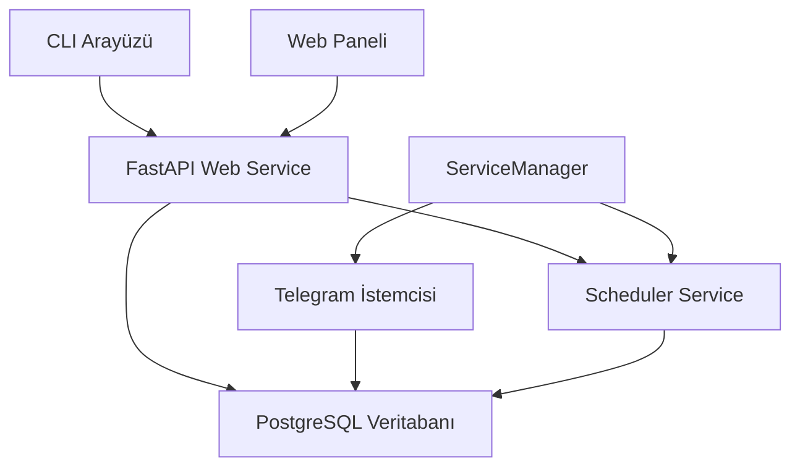

# Telegram Bot Dokümantasyonu

Telegram Bot, çoklu Telegram hesap yönetimini kolaylaştıran, API ve CLI arayüzleri sunan gelişmiş bir otomasyon aracıdır.

## Özellikler

- **Çoklu Hesap Yönetimi**: Birden fazla Telegram hesabını tek bir arayüzden yönetme
- **Otomatik Mesajlaşma**: Zamanlanmış mesaj gönderimi ve otomatik cevaplama
- **Grup Yönetimi**: Grupları toplu izleme, analiz etme ve yönetme
- **Veri Analitiği**: Mesaj ve kullanıcı etkileşimleri üzerinde detaylı analizler
- **API & CLI**: Esnek entegrasyon için API ve komut satırı arayüzleri
- **WebUI**: Kullanıcı dostu web yönetim paneli

## Başlangıç

Telegram Bot'un kurulumu ve kullanımı hakkında bilgi almak için [Kurulum](kurulum/baslangic.md) bölümüne göz atabilirsiniz.

## Servis Mimarisi

Telegram Bot, aşağıdaki temel servislerden oluşur:

## Teknoloji Yığını

Bu projede kullanılan temel teknolojiler:

- **Backend**: Python, FastAPI, SQLAlchemy
- **Veritabanı**: PostgreSQL
- **Telegram API**: Pyrogram, Telethon
- **Konteynerleştirme**: Docker, Docker Compose
- **CI/CD**: GitHub Actions
- **Dokümantasyon**: MkDocs, Material Theme
- **Test**: Pytest, Pytest-asyncio

## Lisans

Bu proje MIT lisansı altında dağıtılmaktadır. Detaylar için [LICENSE](https://github.com/username/telegram-bot/blob/main/LICENSE) dosyasına bakabilirsiniz. 